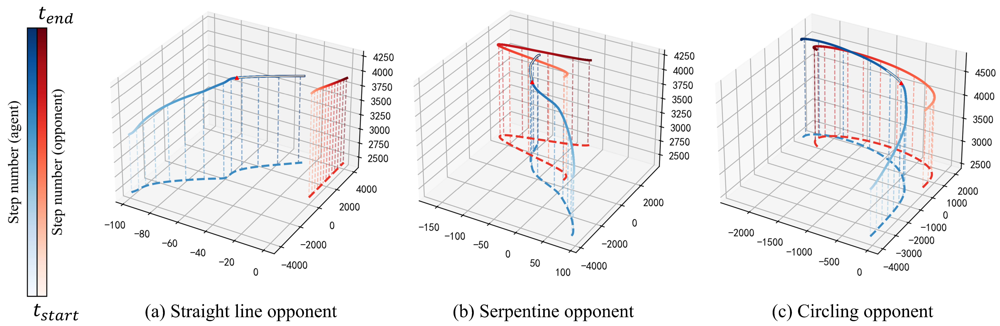

[**ENGLISH**](README.md) | [**中文**](assets/README_CN.md)

<h1 align='center'> Highly Imitative Reinforcement Learning for UCAV </h1>

This is the implementation of [*An Imitative Reinforcement Learning Framework for Autonomous Dogfight*](https://arxiv.org/abs/2406.11562).
The expert dataset, the trained models, and recorded videos of the learned policies are available at [Google Drive](https://drive.google.com/drive/folders/1lAllxmsy0MhW714ZmT8fb0MkdJktUxzJ?usp=sharing).

## Installation

### Install Environment Dependencies

Please follow [the official instructions](https://github.com/harfang3d/dogfight-sandbox-hg2) to install Dogfight Sandbox.

<!-- Alternatively, installation can also be done directly from one of the following links: [Link 1](https://github.com/harfang3d/dogfight-sandbox-hg2/releases/download/v1.3.1/dogfight-sandbox-hg2.zip) or [Link 2](https://drive.google.com/file/d/1FihtrwnwGt0FXaVlGS4881yN3oYpbdlw/view?usp=drive_link). -->

### Install HIRL

```bash
conda create -n hirl python=3.8
conda activate hirl
git clone https://github.com/zrc0622/HIRL4UCAV.git
cd HIRL4UCAV
conda install pytorch==1.13.0 torchvision==0.14.0 torchaudio==0.13.0 pytorch-cuda=11.7 -c pytorch -c nvidia
pip install -e .
```

## Usage

### Prerequisites
Download the `expert_data` and `bc_actor` folders from [Google Drive](https://drive.google.com/drive/folders/1lAllxmsy0MhW714ZmT8fb0MkdJktUxzJ?usp=sharing) and place them in the repository. 
Update the IP address in the `local_config.yaml` file.

### Run Experiments
Once the prerequisites are set, you can run experiments using the following command:

```bash
python hirl/train_all.py --port=<ENV_PORT> --env=<ENV_TYPE> --random --agent=HIRL --type=<HIRL_TYPE> --model_name=<MODEL_NAME>
```

Replace placeholders with your specific setup.

<!-- - `<ENV_PORT>`: The port number for the training environment (e.g., 12345).
- `<ENV_TYPE>`: The type of training environment (e.g., "straight_line", "serpentine", "circular").
- `<HIRL_TYPE>`: The variant of the HIRL algorithm (e.g., "soft", "linear", "fixed").
- `<MODEL_NAME>`: The name of the trained model to be saved (e.g., "HIRL_soft"). -->

## Performance

### Comparative Results

<div align="center">
  
</div>

### Policy Trajectories

<div align="center">
  
</div>

## Citation

```bibtex
@misc{li2024imitative,
    title={An Imitative Reinforcement Learning Framework for Autonomous Dogfight}, 
    author={Siyuan Li and Rongchang Zuo and Peng Liu and Yingnan Zhao},
    year={2024},
    eprint={2406.11562},
    archivePrefix={arXiv}
}
```